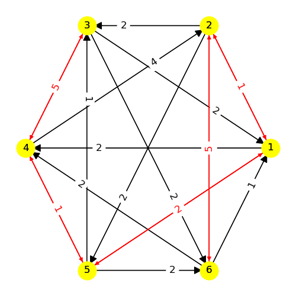

----
# Model 4 #
## Phases ##

## Web ##
Inverse Triality on node 1|
:-------------------:|
|

Triality on node 5|
:-------------------:|
|

----
## References ##
[[1] https://arxiv.org/pdf/2203.15816.pdf](https://arxiv.org/pdf/2203.15816.pdf)

[[2] https://link.springer.com/content/pdf/10.1007/JHEP05(2016)020.pdf](https://link.springer.com/content/pdf/10.1007/JHEP05(2016)020.pdf)
