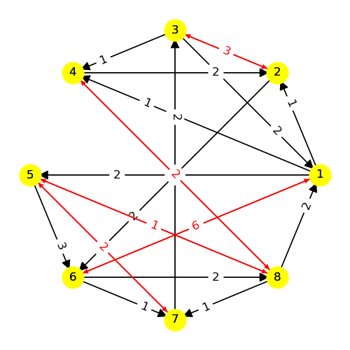

# Model 11 #

| | | |
|---|---|---|
|Phase 1|Phase 2|Phase 3|
        
| | | |
|---|---|---|
|Phase 4|Phase 5|Phase 6|
        
| | | |
|---|---|---|
|Phase 7|Phase 8|Phase 9|
        
| | | |
|---|---|---|
|Phase 10|Phase 11|Phase 12|
        
| | | |
|---|---|---|
|Phase 13|Phase 14|Phase 15|
        
| | | |
|---|---|---|
|Phase 16|Phase 17||

---
## Web Table ##
---
||Phase 1|Phase 2|Phase 3|Phase 4|Phase 5|Phase 6|Phase 7|Phase 8|Phase 9|Phase 10|Phase 11|Phase 12|Phase 13|Phase 14|Phase 15|Phase 16|Phase 17|
|---|---|---|---|---|---|---|---|---|---|---|---|---|---|---|---|---|---|
Phase 1||3|-3|4|5|||||||||||||
Phase 2|-3||3|||2|-4|5|7|||||||||
Phase 3|3|-3||||||||4|-4|5|7|-7||||
Phase 4|-4, 8|||||||||-3, 5||||||||
Phase 5|-5||||||-8|3|1|4|6|-3|||-7|||
Phase 6||-2, 7||||||||||||||-4, 5||
Phase 7||4|||7|||||5|3||||-2|2||
Phase 8||1, -5|||-3, 7|||||-4, 6||3, -7||||2, -8||
Phase 9||2, -7|||-4, 5||||||||3, -6|||||
Phase 10|||-4|3|8||-2|5|||4||-7||||7|
Phase 11|||4, -7||-2, 5||-3, 8|||-4, 7||||||||
Phase 12|||-5, 6||3, -4|||-3, 4|||||||7, -8|||
Phase 13|||-7||||||-3|-4||||7|5||4|
Phase 14|||-4, 7||||||||||4, -7|||||
Phase 15|||||7||6|||||3|1|||-6||
Phase 16||||||4|-2|7|||||||2||5|
Phase 17||||||||||4, -7|||-4, 7|||-2, 5||
