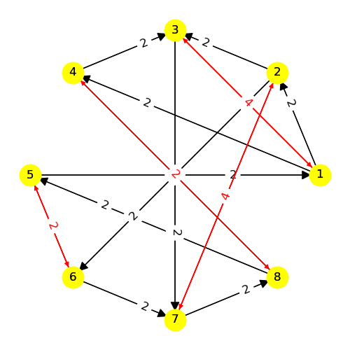
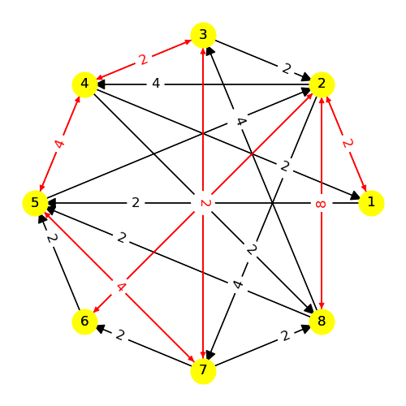
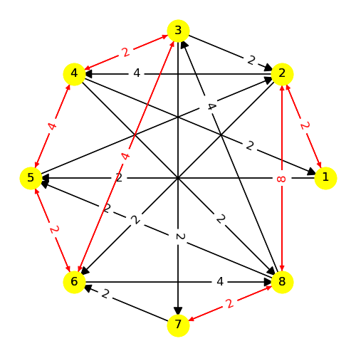
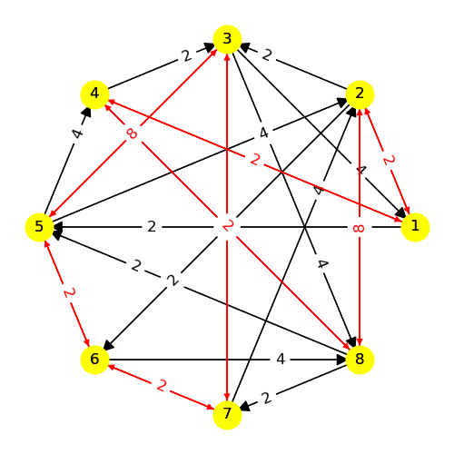
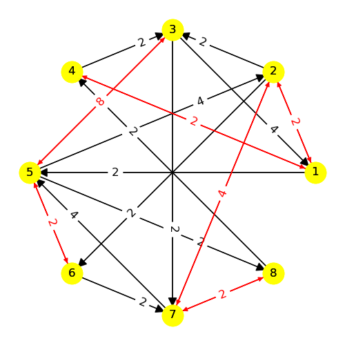

# Model 12 #

| |
|---|
|Phase 1|

| |
|---|
|Phase 2|

| |
|---|
|Phase 3|

| |
|---|
|Phase 4|

| |
|---|
|Phase 5|

| |
|---|
|Phase 6|

| |
|---|
|Phase 7|

| |
|---|
|Phase 8|

| |
|---|
|Phase 9|

| |
|---|
|Phase 10|

| |
|---|
|Phase 11|

| |
|---|
|Phase 12|

| |
|---|
|Phase 13|

| |
|---|
|Phase 14|

| |
|---|
|Phase 15|

| |
|---|
|Phase 16|

| |
|---|
|Phase 17|

| |
|---|
|Phase 18|

| |
|---|
|Phase 19|

| |
|---|
|Phase 20|

| |
|---|
|Phase 21|

---
## Web Table ##
---
||Phase 1|Phase 2|Phase 3|Phase 4|Phase 5|Phase 6|Phase 7|Phase 8|Phase 9|Phase 10|Phase 11|Phase 12|Phase 13|Phase 14|Phase 15|Phase 16|Phase 17|Phase 18|Phase 19|Phase 20|Phase 21|
|---|---|---|---|---|---|---|---|---|---|---|---|---|---|---|---|---|---|---|---|---|---|
Phase 1||1|-1, 6|3|4|-6|-7|-8||||||||||||||
Phase 2|-1, -6||1, 6||||||3|-4, -7|5|-8||||||||||
Phase 3|1, -5|-1|4, -6||2|5|-8||||||3|-4, 6|-7|||||||
Phase 4|-3||||6|||-7|1||||-1|||-6|7|||||
Phase 5|-4||-1|-8|||||||||6|||8||-6|-7|||
Phase 6|1, 6||-1, -6||||||-8||-2|||||3||4, 7||||
Phase 7|7||6|||||3||1||-3|||-1||||4|||
Phase 8|8|||4|||-1||-6|||1|||6||-4|||||
Phase 9||-3||-1, -6||5||4, 7|||||1, 6||-4, -7|||||||
Phase 10||4, 5|||||-3, -6|||||||1|3, 6|||||-7||
Phase 11||-4, -5, -7||||1, 3, 6||||||||||||||||
Phase 12||8|||||1, 6|-1, -6||||||||||||||
Phase 13|||-3, -4|1, 7|-5, -6||||-1, -7|||||||||5, 6||||
Phase 14|||3, -3, 4, -4, 5, -5, 6, -6|||||||-1, -7||||||||2, 8||||
Phase 15|||6, 7||||1, 4|-3, -5|3, 5|-1, -4||||||||||||
Phase 16||||1, 6|-1, -6|-3||||||||||||||||
Phase 17||||-1, -7||||1, 7||||||||||||||
Phase 18|||||6, 8|-2, -4|||||||-6, -8|-1|||||||7|
Phase 19|||||6, 7||-1, -4|||||||||||||||
Phase 20||||||||||1, 3, 4, 5, 6, 7||||||||||||
Phase 21||||||||||||||||||-1, -2, -4, -6, -7, -8||||