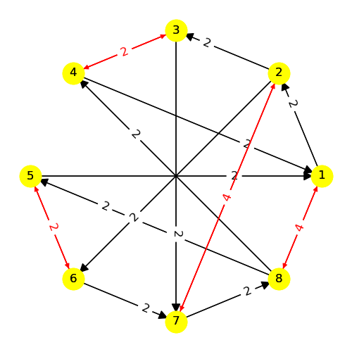

---
# Model 12 #
---

| | | |
|---|---|---|
|Phase 1|Phase 2|Phase 3|
        
| | | |
|---|---|---|
|Phase 4|Phase 5|Phase 6|
        
| | | |
|---|---|---|
|Phase 7|Phase 8|Phase 9|
        
| | | |
|---|---|---|
|Phase 10|Phase 11|Phase 12|
        
| | |
|---|---|
|Phase 13|Phase 14|
        
---
## Web Table ##
---
||[Phase 1](./model12_phase_0.png)|[Phase 2](./model12_phase_1.png)|[Phase 3](./model12_phase_2.png)|[Phase 4](./model12_phase_3.png)|[Phase 5](./model12_phase_4.png)|[Phase 6](./model12_phase_5.png)|[Phase 7](./model12_phase_6.png)|[Phase 8](./model12_phase_7.png)|[Phase 9](./model12_phase_8.png)|[Phase 10](./model12_phase_9.png)|[Phase 11](./model12_phase_10.png)|[Phase 12](./model12_phase_11.png)|[Phase 13](./model12_phase_12.png)|[Phase 14](./model12_phase_13.png)|
|---|---|---|---|---|---|---|---|---|---|---|---|---|---|---|
[Phase 1](./model12_phase_0.png)||1, -6|-1, 6|3, -8|4, -7||||||||||
[Phase 2](./model12_phase_1.png)|-1, -6||1, 6|||3|-4, -7|5|-8||||||
[Phase 3](./model12_phase_2.png)|1, -5|-1, 5|4, -6||2, -8|||||3, -7|-4, 6||||
[Phase 4](./model12_phase_3.png)|-3|||-7|6|1|||-6|-1||7|||
[Phase 5](./model12_phase_4.png)|-4||-1|-8|||-6||8|6|||-7||
[Phase 6](./model12_phase_5.png)||-3, 5||-1, 4, -6, 7||||||1, -4, 6, -7|||||
[Phase 7](./model12_phase_6.png)||4, 5|||-3, -6|||||3, 6|1|||-7|
[Phase 8](./model12_phase_7.png)||1, 3, -4, -5, 6, -7|||||||||||||
[Phase 9](./model12_phase_8.png)||8||-1, -6|1, 6||||||||||
[Phase 10](./model12_phase_9.png)|||-3, -4|1, 7|-5, -6|-1, -7|5, 6||||||||
[Phase 11](./model12_phase_10.png)|||3, -3, 4, -4, 5, -5, 6, -6||||-1, 2, -7, 8||||||||
[Phase 12](./model12_phase_11.png)||||1, -1, 7, -7|||||||||||
[Phase 13](./model12_phase_12.png)|||||-1, -4, 6, 7||||||||||
[Phase 14](./model12_phase_13.png)|||||||1, 3, 4, 5, 6, 7||||||||

