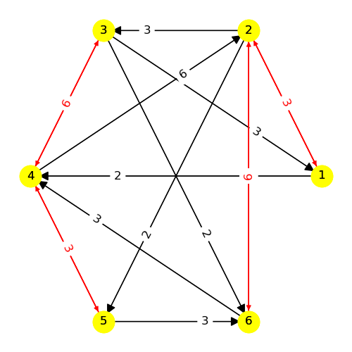
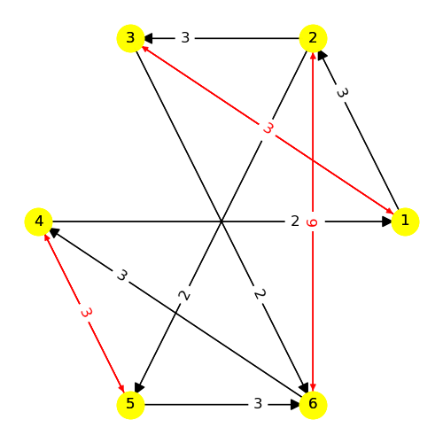

---
# Model 2 #
---

| | |
|---|---|
|Phase 1|Phase 2|
        
---
## Web Table ##
---
||[Phase 1](./model2_phase_0.png)|[Phase 2](./model2_phase_1.png)|
|---|---|---|
[Phase 1](./model2_phase_0.png)||-1, 5|
[Phase 2](./model2_phase_1.png)|1, -4|-3, 5|

