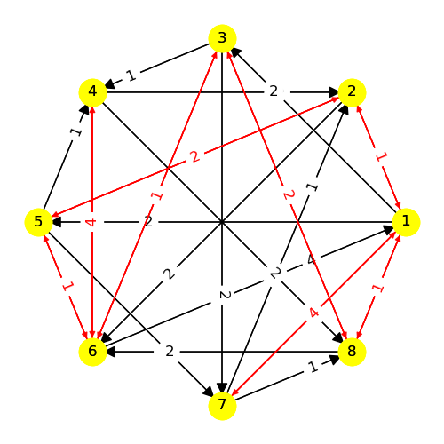
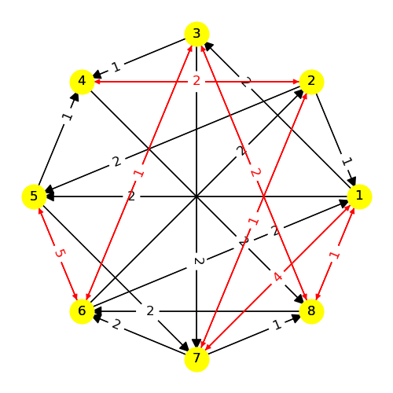
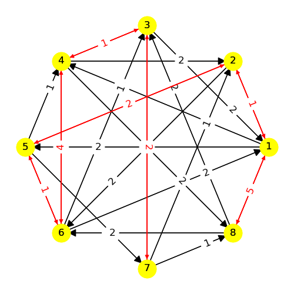
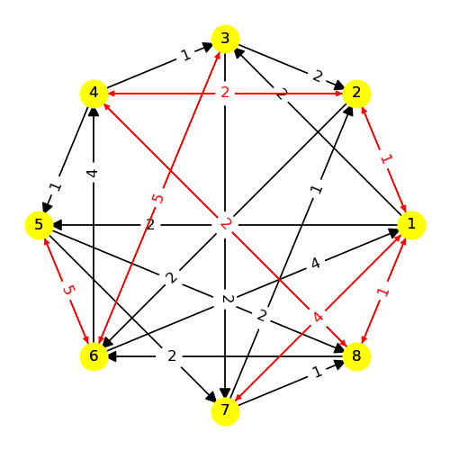
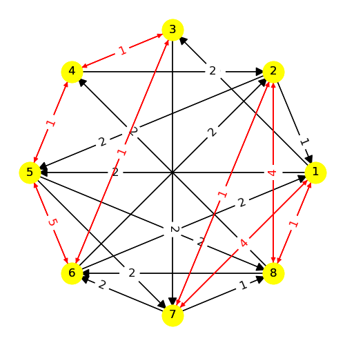
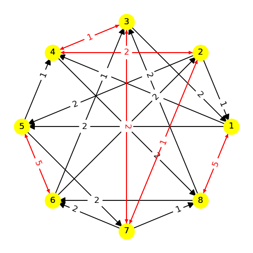

# Model 6 #

| |
|---|
|Phase 1|

| |
|---|
|Phase 2|

| |
|---|
|Phase 3|

| |
|---|
|Phase 4|

| |
|---|
|Phase 5|

| |
|---|
|Phase 6|

---
## Web Table ##
---
||Phase 1|Phase 2|Phase 3|Phase 4|Phase 5|Phase 6|
|---|---|---|---|---|---|---|
Phase 1||-2, 3, 5, -8|4, -7||||
Phase 2|2|4|-8|3|-4||
Phase 3|-4|-2, -8||||-7|
Phase 4||2, -3, -4, 7|||||
Phase 5||3, -3, 4, -4|||||
Phase 6|||-4, 7||||