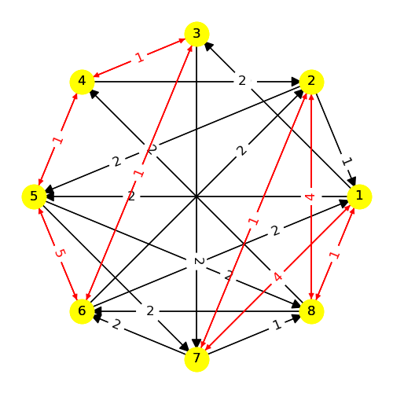
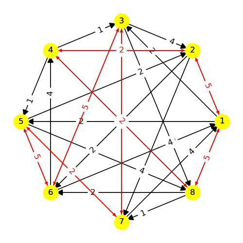

# Model 6 #

| | ||
|:---:|:---:|:---:|
|Phase 1|Phase 2 | Phase 3|

|
|---|
|Phase 2|

|
|---|
|Phase 3|

| |
|---|
|Phase 4|

| |
|---|
|Phase 5|

| |
|---|
|Phase 6|

| |
|---|
|Phase 7|

| |
|---|
|Phase 8|

---
## Web Table ##
---
||Phase 1|Phase 2|Phase 3|Phase 4|Phase 5|Phase 6|Phase 7|Phase 8|
|---|---|---|---|---|---|---|---|---|
Phase 1||-2, -8|3, 5|4|-7||||
Phase 2|2||4||-8|3|-4||
Phase 3|-3|-7||5||-2|7||
Phase 4|-4||-2, -8|||||-7|
Phase 5|7|3, 5||||||4|
Phase 6||-3, -4|2, 7||||||
Phase 7||3, 4|-3, -4||||||
Phase 8||||7|-4||||