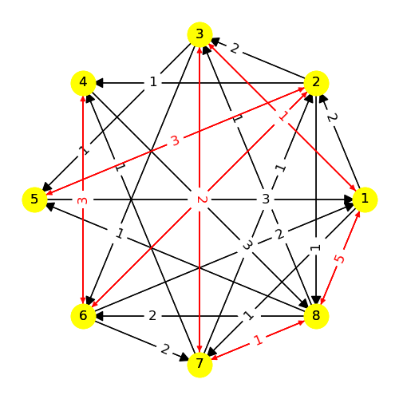
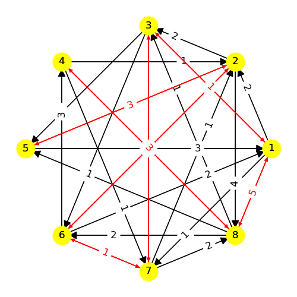

---
# Model 7 #
---

| | | |
|---|---|---|
|Phase 1|Phase 2|Phase 3|
        
| | | |
|---|---|---|
|Phase 4|Phase 5|Phase 6|
        
---
## Web Table ##
---
||[Phase 1](./model7_phase_0.png)|[Phase 2](./model7_phase_1.png)|[Phase 3](./model7_phase_2.png)|[Phase 4](./model7_phase_3.png)|[Phase 5](./model7_phase_4.png)|[Phase 6](./model7_phase_5.png)|
|---|---|---|---|---|---|---|
[Phase 1](./model7_phase_0.png)||-3, -7|4|5|||
[Phase 2](./model7_phase_1.png)|3, -7|5|||-2, -6|4|
[Phase 3](./model7_phase_2.png)|-4, 5|||||-3, 7|
[Phase 4](./model7_phase_3.png)|4, -5||||3, -7||
[Phase 5](./model7_phase_4.png)||2, -6||5||-7|
[Phase 6](./model7_phase_5.png)||-4|3||5||

